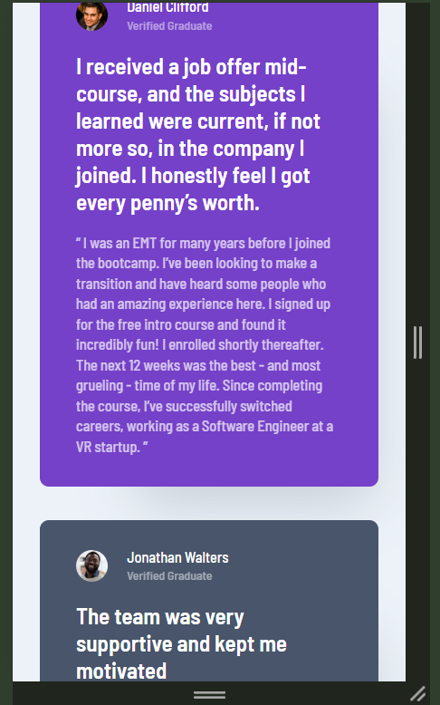

# Responsive Design Project

https://dictionaryfrancisprojeto-testimonals.netlify.app/

## Overview

This project is a simple yet practical example of a responsive website built using only HTML and CSS. The primary goal of this project was to gain hands-on experience with key web design techniques, particularly **Flexbox**, **CSS Grid**, and **Responsive Design**. 

The website is designed to be fully responsive, ensuring that the layout and content are accessible and aesthetically pleasing across a wide range of devices, from mobile phones to large desktop screens.

## Features

- **Responsive Design**: The layout adapts seamlessly to different screen sizes using media queries.
- **Flexbox**: Used for aligning and distributing space among items in a container, even when their size is unknown or dynamic.
- **CSS Grid**: Utilized for creating complex layouts more easily, especially when dealing with two-dimensional layouts.

## Technologies Used

- **HTML5**: For the structure and content of the website.
- **CSS3**: For styling, layout, and responsive design.
  - **Flexbox**: For one-dimensional layouts, such as aligning items in a row or column.
  - **CSS Grid**: For two-dimensional layouts, making it easier to design complex and responsive grids.
  - **Media Queries**: For applying different styles based on screen size, ensuring the design is mobile-first and fully responsive.

